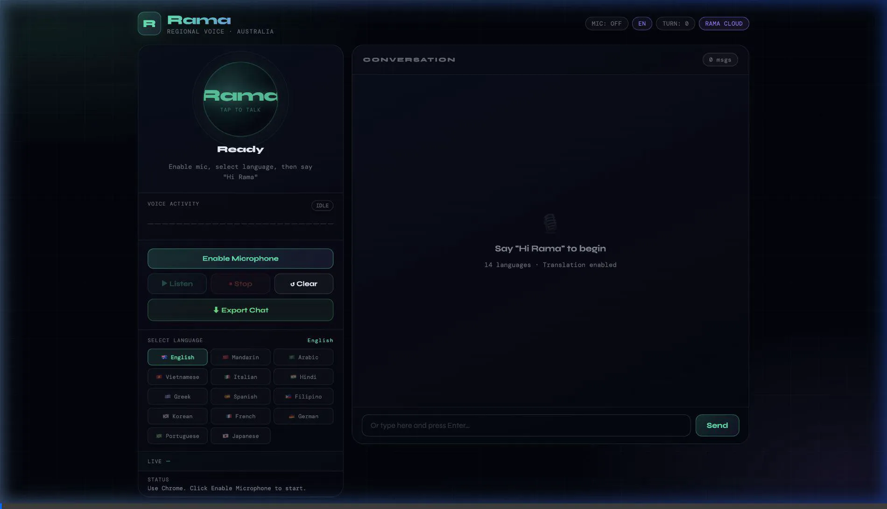

# Rama — Multilingual Regional Voice Assistant for Australia🇦🇺🎙️

Rama is a high-performance, multilingual voice assistant designed specifically for migrants and tourists in Australia. It provides real-time information on transport, emergency services, local attractions, and more, using the Web Speech API and Groq's high-speed Llama 3 AI.



## 🚀 Live Demo

**[👉 CLICK HERE TO TALK TO RAMA](https://rama-voice-bot.vercel.app)**

### 🌟 Core Features & Resilience Architecture

*   **Robust Multi-Mode AI Engine**:
    *   `🟢 Rama Cloud`: Uses server-side Groq keys securely proxying queries.
    *   `🔵 Custom API Key`: Users can securely save their own free Groq API key in browser `localStorage` (passed via custom headers to prevent key exposure and CORS).
    *   `🟡 Offline Fallback`: Dynamically falls back to a rule-based matching engine when cloud limits or rate limits are reached, showing a professional resilience model.
*   **Zero-Install**: Works directly in Google Chrome via standard Web Speech API.
*   **14 Supported Languages**: Including English, Mandarin, Arabic, Hindi, Spanish, Vietnamese, and more.
*   **Real-time Translation**: Automatically detects, translates, and synthesizes non-English speech.

## 🏛️ Project Architecture

This project follows a modern **Client-Server Architecture**:

1.  **Frontend (Vanilla JS Modules)**: High-performance, modular ES6 code for Speech and UI logic.
2.  **Backend (Python/Flask)**: A secure gateway to the Groq API, protecting credentials and managing AI context.
3.  **API Layer (Groq)**: Uses the cutting-edge **Llama 3.3 70B** model for lightning-fast regional intelligence.

---

## 🛠️ Developer Setup (Local Development)

The following steps are only required if you wish to run Rama on your local machine or contribute to the project.

### Prerequisites
- Python 3.8+
- A Groq API Key ([Get one here](https://console.groq.com))

### Local Installation
1.  **Clone the repository**:
    ```bash
    git clone https://github.com/radhika-verma06/Rama-VoiceBot.git
    cd Rama-VoiceBot
    ```
2.  **Install dependencies**:
    ```bash
    pip install -r requirements.txt
    ```
3.  **Configure Environment Variables**:
    Create a `.env` file in the root directory:
    ```env
    GROQ_API_KEY=your_groq_api_key_here
    ```
4.  **Start the Server**:
    ```bash
    python app.py
    ```
5.  **Access the App**:
    Open `http://localhost:5001` in **Google Chrome**.

### ☁️ Deployment (Vercel)
This project is optimized for **Vercel Serverless Functions**. To deploy your own version:
1. Run `vercel` in the root directory.
2. Add `GROQ_API_KEY` to your Vercel environment variables.
3. Run `vercel --prod`.

---

## 📂 Project Structure
```text
.
├── app.py              # Flask Backend & AI Proxy
├── requirements.txt     # Python Dependencies
├── vercel.json         # Serverless Configuration
├── src/                # Frontend Source
│   ├── index.html      # Main Entry Point
│   └── assets/
│       ├── css/        # Styling modules
│       └── js/         # Modular Logic (UI, Speech, API)
└── legacy/             # Original prototype backup
```

## 🛡️ License
Distributed under the MIT License.

## 🤝 Contact
[Radhika Verma](https://github.com/radhika-verma06)
Project Link: [https://github.com/radhika-verma06/Rama-VoiceBot](https://github.com/radhika-verma06/Rama-VoiceBot)
